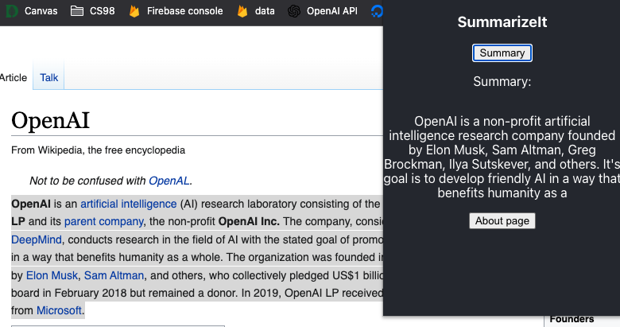
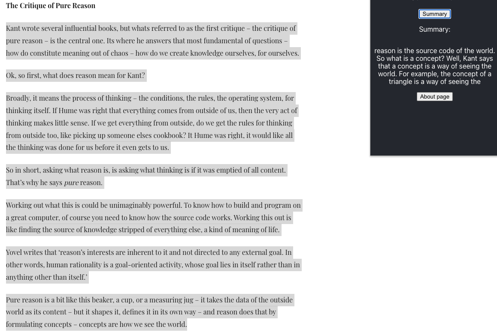

## 1. Why/What:
I hate lengthy, dense readings. Sometimes I just wish I had a summarization bot that could give me a sense of what the text is saying without having to dive into a lengthy passage. This brought me to OpenAI. They've created a powerful NLP model, GPT-3. Among many of its functionalities is a TL;DR (Too Long, Didn't Read) bot. I wanted to be able to use it on any website, so I built my own chrome extension.

SummarizeIt is a google chrome extension that summarizes any text. Highlight any text, fire up the SummarizeIt extension and it will summarize the text in under a second. 


## 2. How I built it:

Built using React, Node (v16.13.1), Yarn (1.22.17). The summaries are generated using OpenAi's GPT-3 Davinci model. The powerful AI generates text based on an input. SummarizeIt uses TL:DR; (Too Long: Didn't Read) which is a capability of GPT-3. TL:DR; generates sumarries of input text which I then display in the SummarizeIt chrome extension.

## 2. How to build this extension:
Sign up for OpenAI access at https://beta.openai.com/

```
$ yarn
$ touch .env
$ echo "REACT_APP_OPENAI_API_KEY=$your_openAI_secret_key" > .env
$ yarn run build
```

## 3. How to add it to your Chrome browser:


Select `/build` folder

Creds to Nemrosim for the Chrome React Framework:
[Chrome React Framework](https://github.com/nemrosim/chrome-react-extension-example)


